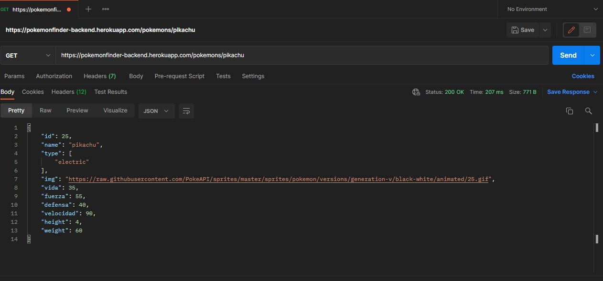

# pokemon-backend
#PROYECTO BACKEND API  DE POKEMON SE PUEDE CONSUMIR TANTO POR LOCAL HOST COMO DE FORMA REMOTA 
#<h1>ENDPOINTS EJEMPLOS</h1>
    -GET: https://pokemonfinder-backend.herokuapp.com/pokemons/pikachu
    -GET: https://pokemonfinder-backend.herokuapp.com/pokemons/4
    -GET https://pokemonfinder-backend.herokuapp.com/pokemons/         (TRAE TODOS LOS POKEMONS)
    
    -GET:http:localhost:3001/pokemons/${NOMBREPOKEMON:STRING}
    -GET:http:localhost:3001/pokemons/${id}
    
    [ ] __GET /pokemons/{idPokemon}__: trae el pokemon por id
    [ ] __GET /pokemons/{namePokemon}__: trae el pokemon por nombre
    [ ] __GET /pokemons__:Trae el listado de los pokemons
    
    PARA CONSUMIR DE FORMA LOCAL EJECUTAR NPM INSTALL Y LUEGO NPM START
    
    

  

